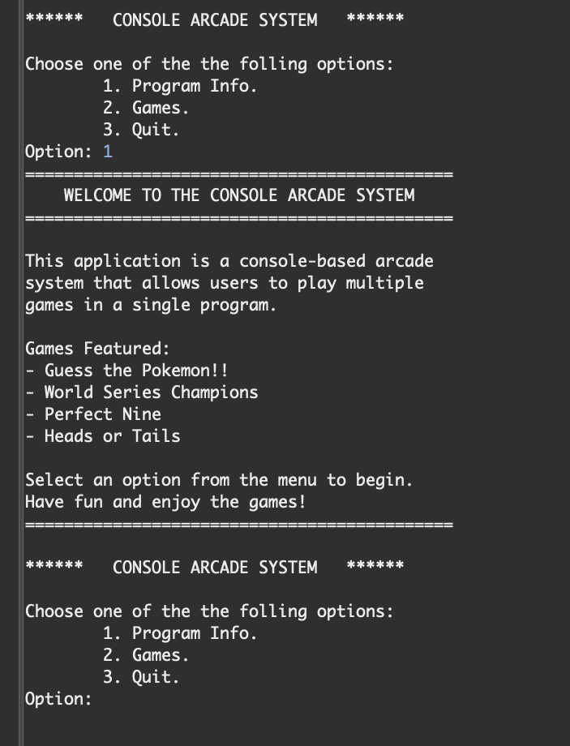
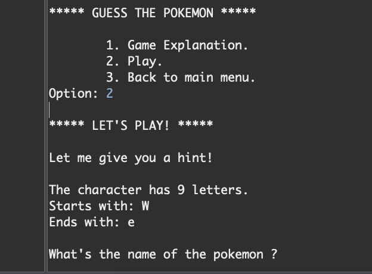

# 🎮 Console Arcade System

---

## 📌 Overview

The **Console Arcade System** is a Java-based console application that simulates an arcade experience.  
It allows users to navigate menus and play multiple mini-games in a single program.

This project focuses on:
- Object-Oriented Programming (OOP)
- Interface-based design
- Modular architecture
- Separation of game logic and engine layers
- Menu-driven UI systems

---

## 🕹️ Games Included

- 🐉 Guess The Pokémon
- ⚾ World Series Champions
- 🔢 The Perfect Nine
- 🪙 Heads or Tails (Coin Flip)

---

## 🧠 Architecture

The system is structured using a modular design:
## 📸 Screenshots

### Main Menu

### Pokémon Game

### Coin Flip
